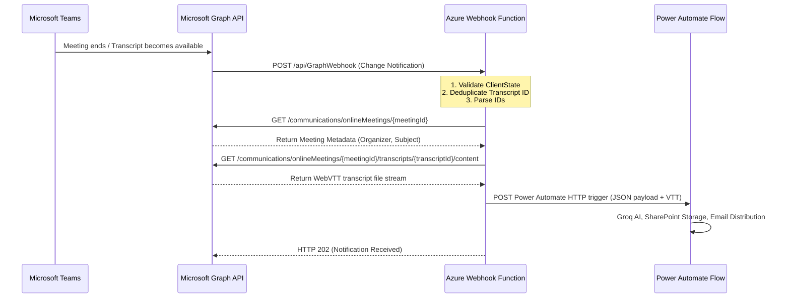

# Meridian Teams Meeting Intelligence Webhook

A production-ready Azure Functions (Node.js v4 programming model) application that integrates with Microsoft Graph to receive real-time change notifications when a Microsoft Teams meeting transcript becomes available. 

The application retrieves meeting metadata and the raw WebVTT transcript content, deduplicates events, and securely forwards the data to a Power Automate flow for summarization and archiving.

---

## Architecture Flow



---

## Features

*   **Online Meeting Transcript Subscriptions**: Dynamically monitors meetings tenant-wide without hardcoded join URLs.
*   **Duplicate Detection**: Ensures transcript files are not processed or sent downstream multiple times.
*   **Automatic Subscription Renewal**: Utilizes an internal Azure Functions Timer Trigger to check and renew subscriptions every 12 hours before expiration.
*   **Dead Letter Event Logging**: Captures failures, logs raw payload metadata, and prevents event loss under transient network conditions.
*   **Robust Retries**: Incorporates exponential backoff with jitter on calls to Microsoft Graph and Power Automate.
*   **Secure Validation**: Validates client states on every notification batch.
*   **Health Diagnostics**: Includes a `/health` endpoint for monitoring probes.

---

## File Structure

```text
├── docs/
│   ├── AzureAppRegistration.md  # Entra ID App registration and Teams policy setup
│   └── PowerAutomate.md         # Downstream Power Automate Cloud Flow configuration
├── payloads/
│   └── sample-notification.json # Sample webhook JSON from MS Graph
├── scripts/
│   └── manageSubscription.js    # CLI tool to create, view, and delete subscriptions
├── src/
│   ├── config.js                # App configurations loader & validator
│   ├── index.js                 # Azure Functions setup configuration
│   ├── functions/
│   │   ├── GraphWebhook.js      # Webhook notification receiver & coordinator
│   │   ├── Health.js            # GET /health health probe endpoint
│   │   └── RenewSubscription.js # Timer Trigger for automatic renewal
│   ├── services/
│   │   ├── authService.js       # Client credentials auth caching service
│   │   └── graphService.js      # API client wrappers for Graph
│   └── utils/
│     ├── logger.js              # Structured logs with audit/dead letter formatting
│     └── retry.js               # Retry utility (exponential backoff & jitter)
├── host.json                    # Azure Function host-level config
├── local.settings.json          # Local secrets config for dev
├── package.json                 # Node dependencies and helper scripts
└── README.md                    # This document
```

---

## Local Development Setup

### 1. Prerequisites
*   Node.js 18 or 20
*   [Azure Functions Core Tools v4](https://learn.microsoft.com/en-us/azure/azure-functions/functions-run-local) (`npm i -g azure-functions-core-tools@4`)
*   An Entra ID app registration and Teams Application Access Policy configured (see [docs/AzureAppRegistration.md](docs/AzureAppRegistration.md)).
*   A tunneling service (e.g. `ngrok` or `devtunnel`) to expose port 7071 to the public internet.

### 2. Install Dependencies
```bash
npm install
```

### 3. Expose Local Server
Start your tunnel:
```bash
ngrok http 7071
# Copy the public HTTPS forwarding URL (e.g. https://xxxx.ngrok-free.app)
```

### 4. Configuration Settings
Update your [local.settings.json](local.settings.json):
```json
{
  "IsEncrypted": false,
  "Values": {
    "AzureWebJobsStorage": "UseDevelopmentStorage=true",
    "FUNCTIONS_WORKER_RUNTIME": "node",
    "TENANT_ID": "<your-tenant-id>",
    "CLIENT_ID": "<your-client-id>",
    "CLIENT_SECRET": "<your-client-secret>",
    "POWER_AUTOMATE_URL": "<your-power-automate-url>",
    "CLIENT_STATE": "<your-random-secure-string>",
    "WEBHOOK_URL": "https://xxxx.ngrok-free.app/api/GraphWebhook",
    "LIFECYCLE_NOTIFICATION_URL": "https://xxxx.ngrok-free.app/api/GraphWebhook"
  }
}
```

### 5. Start the Webhook
```bash
npm start
```

---

## Subscription Management (CLI)

Use the built-in management script to register the webhook with Microsoft Graph:

```bash
# List all active subscriptions
npm run manage-sub list

# Register a tenant-wide subscription for meeting transcripts
# If LIFECYCLE_NOTIFICATION_URL is configured, it creates a 2-day subscription.
# Otherwise, it creates a 55-minute subscription to avoid lifecycle requirements.
npm run manage-sub create

# Delete an active subscription
npm run manage-sub delete <subscription-id>
```

---

## Azure Deployment Steps

### Step 1: Create a Function App in Azure
1. Log in to the [Azure Portal](https://portal.azure.com/).
2. Click **Create a resource** and search for **Function App**.
3. Select **Node.js** as the runtime stack and version **18** or **20**.
4. Choose **Linux** (recommended) or **Windows** operating system.

### Step 2: Configure Application Settings
Under the **Configuration** menu of your Azure Function App, add the following Application Settings:
*   `TENANT_ID`
*   `CLIENT_ID`
*   `CLIENT_SECRET`
*   `POWER_AUTOMATE_URL`
*   `CLIENT_STATE`
*   `WEBHOOK_URL`: `https://<your-app-name>.azurewebsites.net/api/GraphWebhook`
*   `LIFECYCLE_NOTIFICATION_URL`: `https://<your-app-name>.azurewebsites.net/api/GraphWebhook`

### Step 3: Deploy the Code
You can deploy using Visual Studio Code or the Azure CLI:

```bash
# Login to Azure
az login

# Deploy your folder to the Azure Function App
func azure functionapp publish <your-app-name>
```

### Step 4: Create the Active Subscription
Once deployed and application settings are configured, trigger the initial subscription creation by running the CLI tool:
```bash
# Manually run the create script pointing to Azure App Settings (or set env locally and run)
npm run manage-sub create
```
The internal `RenewSubscription` timer trigger will automatically maintain this subscription and renew it every 12 hours.
